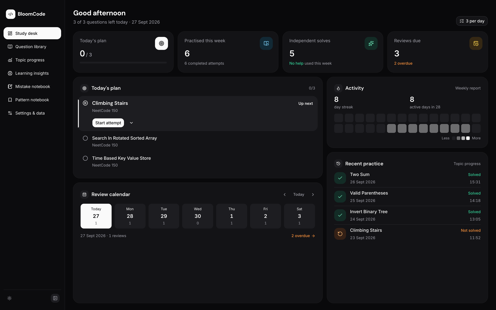
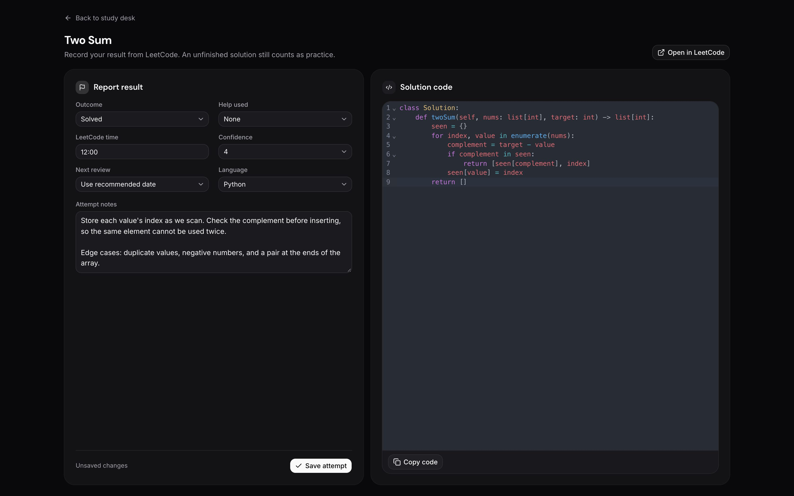
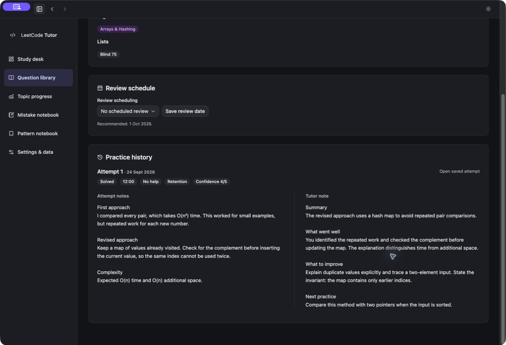

# LeetCode Tutor

A local-first app for planning LeetCode practice, saving solutions and notes, and scheduling reviews. Your progress stays on your computer; an AI tutor is optional.

**Electron · TypeScript · React · Fastify · SQLite / Drizzle · MCP**

[Get started](#get-started) · [Screenshots](#screenshots) · [Engineering](#engineering) · [Documentation](#documentation)



## Get started

**[Download experimental preview — Apple silicon Mac](https://github.com/pritanb/leetcode-tutor/releases/tag/v0.1.0)**

Unzip the download, move **LeetCode Tutor.app** to Applications, and open it. Choose your timezone, daily target and a starter list. Node.js is not needed for the desktop app.

This early desktop release is not Developer ID signed or notarized, so macOS may block the download. See [installation instructions](docs/desktop.md) for details. Intel Macs, Windows and Linux desktop builds are not yet supported.

Solve on LeetCode, then save your result here. The app stores code; it does not execute it or submit answers to LeetCode.

### Run from source

Install **Node.js 22.23 or later**, clone this repository, then run:

```sh
npm ci
npm run build
npm run local
```

Open [localhost:4317](http://127.0.0.1:4317). `npm run local` starts a background server; use `npm start` for a foreground server. For desktop development, see [building the Electron app](docs/desktop.md#build-from-source).

## Try the demo

After installing and building, run `npm run demo` and open [localhost:4331](http://127.0.0.1:4331).

Explore 150 questions, sample practice history and example tutor feedback. You can edit and save freely: the demo uses a separate temporary database and never opens your personal workspace. Stop with Ctrl+C; restart for fresh sample data. This is a local demo, not a public website.

## Screenshots

### Practice workspace

Record results, edit code and keep notes together, with automatic draft saving and light/dark themes.



### Practice history

Compare your attempt notes with tutor feedback side by side.



Screenshots use sample records. Tutor feedback is illustrative; connecting an AI tutor is optional.

## Engineering

- **Reliable saves:** autosaved drafts, version checks and repeat-safe submissions protect saved work.
- **Consistent study records:** daily plans persist across reloads; manual review dates and recorded score decisions stay explicit.
- **Desktop lifecycle:** a bundled local server starts with Electron, shuts down on quit, and prevents concurrent access to the same workspace.
- **Shared backend:** the React UI and MCP tutor adapter use the same authenticated local API.
- **Extensible data:** versioned question packs, validated imports and SQLite backups.
- **Focused tests:** critical function tests, a browser save/reload flow and [automated GitHub checks](.github/workflows/checks.yml).

See the [technical design](docs/technical-design.md) for architecture details.

## Your workspace

Data is stored outside the repository:

- **macOS:** `~/Library/Application Support/LeetCodeTutor/`
- **Linux:** `~/.local/share/leetcode-tutor/` (or under `XDG_DATA_HOME`)
- **Windows:** `%LOCALAPPDATA%\LeetCodeTutor\`

Existing macOS databases in `LeetcodeTutor-dev` keep their location. Copy [.env.example](.env.example) to `.env` to choose a different data directory or port. The app and integrations must use matching settings.

Export your records from Settings, or run `npm run backup` while the app is running. Keep credentials, exports and backups private. See [Operations](docs/operations.md) before updating or restoring.

## Documentation

- [Question packs and extensions](docs/extensions.md) — add your own lists or integrations.
- [Learning Insights](docs/learning-insights.md) — local semantic retrieval, evidence-backed learning patterns, and optional practice suggestions.
- [Optional AI tutor](docs/tutor-integration.md) — automatic reports through the Codex CLI, plus MCP tools for chatting with a tutor about your study data.
- [Sheet migration record](docs/migration.md) — how the original spreadsheet history was imported.
- [Contributing](CONTRIBUTING.md) · [Testing](docs/testing.md) · [UI design](docs/design-system.md).

## License

A project license has not yet been selected. Third-party notices are in [docs/licenses](docs/licenses/) and the [bundled manifests](src/integrations/manifests/README.md).
