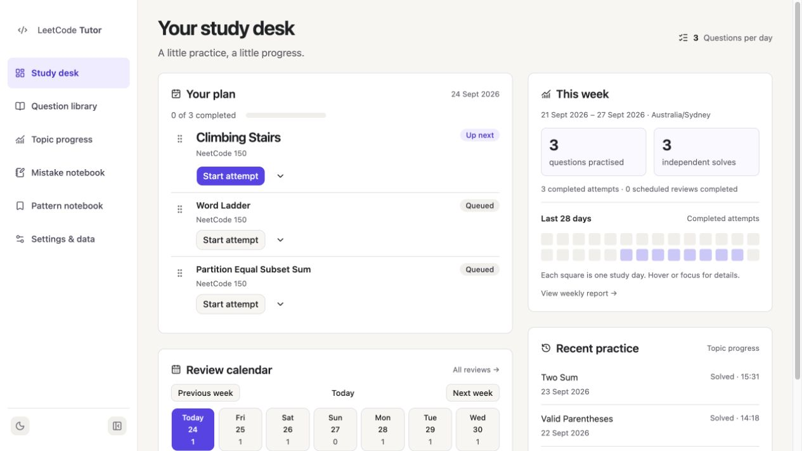
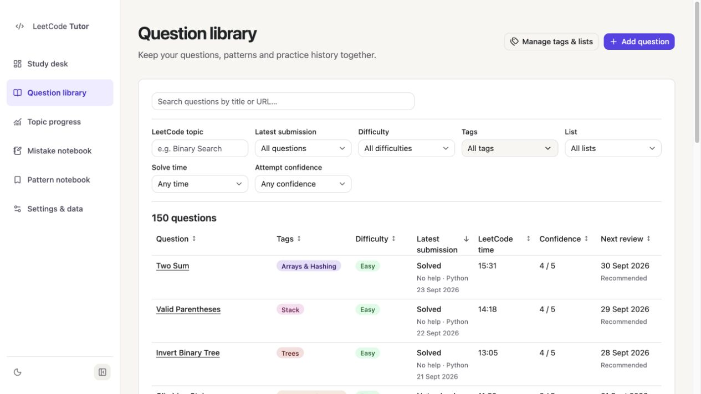
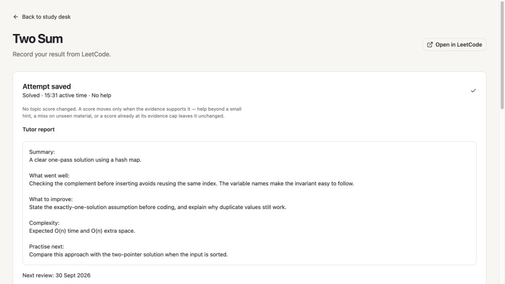

# LeetCode Tutor

A local-first app for planning LeetCode practice, saving solutions and notes, and scheduling reviews. Your progress stays on your computer; an AI tutor is optional.

**TypeScript · React · Fastify · SQLite / Drizzle · MCP**

[Get started](#get-started) · [Screenshots](#screenshots) · [Engineering](#engineering) · [Documentation](#documentation)



## Get started

Install **Node.js 22.23 or later**, clone or download this repository, then run these commands from its folder:

```sh
npm ci
npm run build
npm run local
```

Open [localhost:4317](http://127.0.0.1:4317). Choose your timezone, daily target and a starter list: Blind 75, NeetCode 150, NeetCode 250, or an empty library.

Solve on LeetCode, then save your result here. The app stores code; it does not execute it or submit answers to LeetCode.

`npm run local` runs in the background. Use `npm start` for a foreground server you can stop with Ctrl+C. Windows support has not yet been verified end to end.

## Try the demo

After installing and building, run `npm run demo` and open [localhost:4331](http://127.0.0.1:4331).

Explore 150 questions, sample practice history and example tutor feedback. You can edit and save freely: the demo uses a separate temporary database and never opens your personal workspace. Stop with Ctrl+C; restart for fresh sample data. This is a local demo, not a public website.

## Screenshots

### Practice workspace

Record results, edit code and keep notes together, with automatic draft saving and light/dark themes.


<details>
<summary>Question library and tutor feedback</summary>

**Question library** — filter by topic, difficulty, result and solve time.



**Tutor feedback** — save an optional review alongside a completed attempt.



</details>

## Engineering

- **Reliable saves:** autosaved drafts, version checks and repeat-safe submissions protect saved work.
- **Consistent study records:** daily plans persist across reloads; manual review dates and recorded score decisions stay explicit.
- **Shared backend:** the React UI and MCP tutor adapter use the same authenticated local API.
- **Extensible data:** versioned question packs, validated imports, SQLite backups and portable exports.
- **Focused tests:** critical function tests, a browser save/reload flow and [automated GitHub checks](.github/workflows/checks.yml).

See the [technical design](docs/technical-design.md) for architecture details.

## Your workspace

Data is stored outside the repository:

- **macOS:** `~/Library/Application Support/LeetCodeTutor/`
- **Linux:** `~/.local/share/leetcode-tutor/` (or under `XDG_DATA_HOME`)
- **Windows:** `%LOCALAPPDATA%\LeetCodeTutor\`

Existing macOS databases in `LeetcodeTutor-dev` keep their location. Copy [.env.example](.env.example) to `.env` to choose a different data directory or port. The app and integrations must use matching settings.

Export your records from Settings, or run `npm run backup` while the app is running. Keep credentials, exports and backups private. See [Operations](docs/operations.md) before updating or restoring.

## Documentation

- [Question packs and extensions](docs/extensions.md) — add your own lists or integrations.
- [Optional AI tutor](docs/tutor-integration.md) — connect an MCP client; automatic reports require sampling support.
- [Import existing progress](docs/migration.md) — bring in spreadsheet history.
- [Contributing](CONTRIBUTING.md) · [Testing](docs/testing.md) · [UI design](docs/design-system.md).

## License

A project license has not yet been selected. Third-party notices are in [docs/licenses](docs/licenses/) and the [bundled manifests](src/integrations/manifests/README.md).
