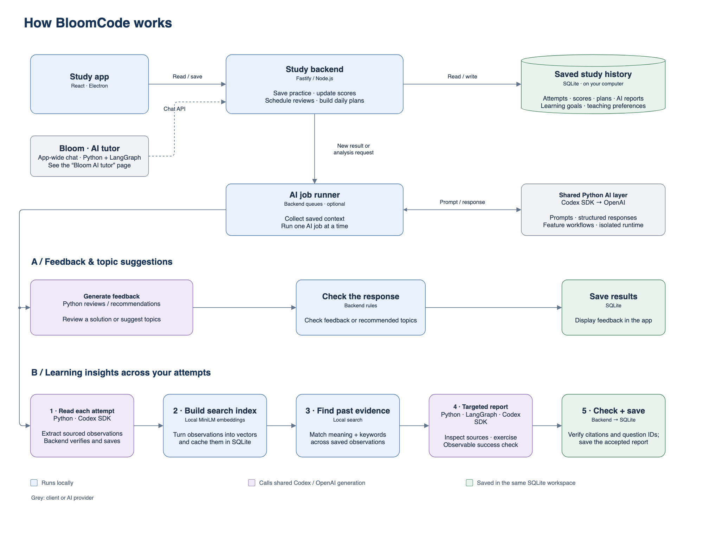
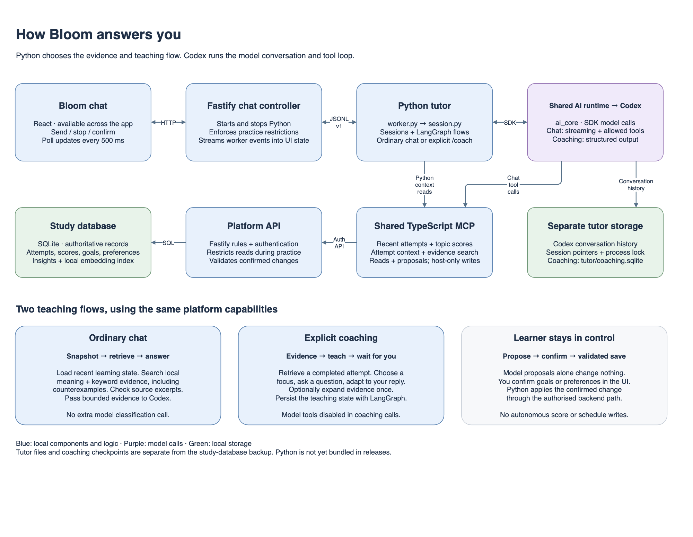
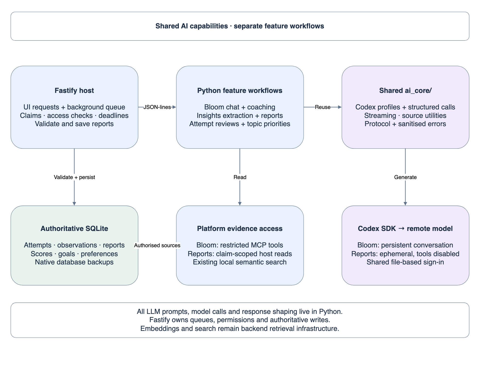

# BloomCode architecture

## Platform overview

Read top to bottom, then follow either background AI path from left to right.
Purple steps call Codex and OpenAI; blue steps run locally; green steps save to
the same SQLite workspace. All LLM calls run in Python; Fastify owns the queues and validates writes.
Bloom's interactive conversation is a separate Python worker, detailed below.

## Bloom AI tutor

1. **Ask Bloom.** The app sends a message to Fastify. Fastify manages the Python
   worker using a versioned JSON-lines protocol. The UI polls every 500 ms to
   display activity and incremental answer text. Stop cancels the request.
2. **Prepare evidence.** Ordinary chat runs the LangGraph sequence
   `snapshot → retrieve → answer`. Python loads recent attempts, topic scores,
   active goals and preferences. It searches existing local Learning Insights
   embeddings and keywords, includes counterexamples, and checks supporting
   excerpts against saved attempts before supplying the evidence to Codex.
   The evidence bundle is bounded to five observations and three inspected
   attempts. Missing Insights produces a limitation rather than invented history.
3. **Generate an answer.** The Codex SDK owns the ordinary conversation and tool
   loop. It receives the message and evidence and can call allowlisted shared
   TypeScript MCP tools. There is no separate model classification call. Study
   storage and retrieval are local; selected context goes to the remote model.
4. **Coach explicitly.** A coaching button or `/coach` starts the separate
   LangGraph teaching loop: gather evidence, teach, wait for the learner, adapt.
   It persists checkpoints in `tutor/coaching.sqlite`. Coaching model calls use
   structured output with model tools disabled; Python retrieves the evidence.
5. **Confirm changes.** Goals and preferences are proposals until you confirm.
   Fastify forwards confirmation to Python; the trusted host calls the shared
   MCP confirmation tool with its host credential. Backend validation and
   duplicate-safe writes remain authoritative. Model tools use a restricted
   credential and cannot directly alter scores, schedules or saved study work.

Fastify enforces active-practice restrictions, including stopping an in-flight
reply. Python and platform evidence reads also check access. Session locking
prevents the app and terminal from writing the same tutor state concurrently.

### Storage and current limits

- **Study SQLite:** attempts, scores, plans, goals, preferences, Learning Insights
  and the local embedding cache. This is the authoritative study workspace.
- **Tutor storage:** Codex history, session pointers, process lock and LangGraph
  coaching checkpoints. Ordinary answer graphs do not create durable checkpoints.
- **Backup boundary:** the study-database backup does not include tutor files.
- **Release boundary:** Python/Codex installation is still required; desktop
  packaging does not yet bundle the Python runtime.

## Source and editing

[Editable draw.io file: both views](bloomcode.drawio)

- [Chat UI](../../src/web/features/tutor/TutorChat.tsx)
- [Fastify worker lifecycle and chat routes](../../src/server/tutor/conversation.ts)
- [Python worker](../../python/worker.py) and [tutor session](../../python/tutor/session.py)
- [Ordinary answer graph](../../python/tutor/answer_graph.py)
- [Coaching graph](../../python/tutor/coaching/graph.py)
- [Shared MCP tools](../../src/integrations/mcp.ts)
- [Tutor setup and implementation details](../../python/README.md)
- [Backend notes](../../src/server/README.md)

Open `bloomcode.drawio` in draw.io or diagrams.net. The first page is the platform
overview; the second is Bloom's architecture. Export each page to its matching
PNG with a white background, check the preview, and commit the source and images
together when the architecture changes.

## Shared Python AI layer

Bloom and reports reuse `python/ai_core/` for Codex runtime isolation, model calls,
evidence utilities and protocol helpers. They run in separate processes: persistent
conversation state for Bloom, temporary tool-free sessions for background reports.

Learning Insights: Fastify claims a job → Python selects evidence → requests up to
eight supporting attempts → generates actionable findings → validates → Fastify
checks current evidence and saves. Model generation uses the Python SDK directly;
only evidence reads and candidate validation cross back to the parent. At most two
model calls share one deadline. Access changes, cancellation or stale evidence stop
work. Missing Python/sign-in is an explicit report error, not a legacy fallback.

Reviews, extraction, topic recommendations and the connection test run through
`python/ai_worker.py` using the same runtime. Each uses one structured call;
only multi-step workflows use LangGraph. TypeScript contains no application LLM
prompts or inference runner. Embedding inference, vector storage and ranking
remain backend retrieval infrastructure.
