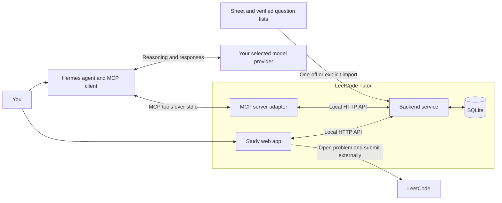

# LeetCode Tutor — Technical Design

**Status:** Proposed, not implemented · **Date:** 16 September 2026  
**Scope:** Personal-use v1, based on [the revised PRD](2026-09-16_004232-leetcode-tutor-prd.md). Topic scoring and the dashboard are included from the first release.

## 1. Architecture

Build one local application backend, not separate services for each feature. The browser and Hermes access the same business logic and database.



- **UI:** React, TypeScript and Vite; CodeMirror for editing; TanStack Query for server state and refetching.
- **Backend:** Node.js + Fastify, Zod validation, SQLite through better-sqlite3 with plain SQL and numbered `.sql` migrations.
- **MCP:** a thin TypeScript SDK adapter launched by Hermes. It translates named tools into authenticated backend requests; it has no model or database of its own.
- **Deployment:** one backend process serves the built UI and API on loopback. A launcher starts it and opens the browser. The MCP adapter is a separate small process only needed for tutoring.
- **AI:** responses use the model selected in Hermes. Daily scheduling, saving and dashboard reads require no model call. Requested reviews may send saved code/context to that provider.

No app-to-Hermes run trigger, built-in judge or hosted service in v1.

## 2. Data model

| Records                                       | Purpose                                                                                                                    |
| --------------------------------------------- | -------------------------------------------------------------------------------------------------------------------------- |
| `problems`, `problem_aliases`                 | Canonical question identity, URL, difficulty, availability and recognised source aliases.                                  |
| `tags`, `problem_tags`                        | Custom patterns; each problem/tag pair has its own optional 1–10 difficulty.                                               |
| `lists`, `list_memberships`                   | Many-to-many list membership without duplicate questions.                                                                  |
| `attempts`, `answer_versions`, `drafts`       | Outcomes, help/exposure, active seconds, code, notes and resumable timer state.                                            |
| `topics`, `topic_scores`, `score_decisions`   | Existing scored categories, current 1–5 values, changes/no-change decisions, rationale and evidence links.                 |
| `attempt_topics`, `topic_tags`                | Explicit links from reviewed evidence and custom tags to scored topics; new tags do not automatically become rated topics. |
| `review_targets`, `daily_plans`, `plan_items` | Effective/recommended review dates, manual overrides, constraint-specific follow-ups and today's statuses.                 |
| `exposures`, `import_records`, `audit_events` | Prior familiarity, original source rows, parsing decisions and audited corrections.                                        |

Use stable IDs, foreign keys and version numbers. Keep scores as fixed-precision values rather than accumulated floating-point deltas. Store durations as integer seconds, timestamps in UTC and study dates using `Australia/Sydney`; retain imported date-only values unchanged. Missing evidence stays null/unknown.

## 3. Feature implementation

All paths below are proposed API routes, not existing endpoints.

| Feature                               | Implementation                                                                                                                                                                                                                                                   |
| ------------------------------------- | ---------------------------------------------------------------------------------------------------------------------------------------------------------------------------------------------------------------------------------------------------------------- |
| **Dashboard**                         | `GET /dashboard` returns today's persisted plan, topic scores, recent movements and attempts in one consistent read. Refetch after saves and when the window regains focus. Keep today's action visually primary.                                                |
| **Question catalogue / add question** | `GET/POST /problems`; validate the LeetCode URL and canonical slug, then deduplicate. Accept editable title/difficulty when automatic metadata is unavailable. Store links rather than scraping full statements.                                                 |
| **Tags and tag difficulty**           | Tag CRUD plus problem/tag assignment endpoints. Rename/archive by stable ID; enforce one assignment per pair and nullable integer difficulty from 1–10.                                                                                                          |
| **Lists**                             | Import versioned, source-linked manifests for NeetCode 150/250 and Blind 75; support custom lists. Memberships reference the same canonical problem. Report unresolved matches rather than guessing.                                                             |
| **Filters and sorting**               | Backend SQL queries support ANY/ALL tags, selected-tag difficulty, result/status, time bucket, list and platform difficulty. Whitelist sort fields, paginate with an ID tie-breaker, and preserve filters in the URL.                                            |
| **Answer editor**                     | Python initially selected, with language choice. Debounced `PATCH /attempts/:id/draft` autosaves code/notes; finalising retains a separate answer version. Previous answers never prefill a hidden assessment.                                                   |
| **Timer and closeout**                | Persist running/paused segments and active seconds. Manual time entry is available. Finish captures outcome/help/time; detailed confidence/testing evidence is optional outside benchmarks. No local code execution.                                             |
| **Review scheduling**                 | A deterministic rule module uses correctness, help and evidence stage. Store recommended and effective dates separately. Overrides, snoozes and explicit no-review take precedence over regeneration.                                                            |
| **Daily refresh**                     | Idempotent `POST /daily-plan/ensure` creates a plan for the local date on launch/day rollover. Resume active work first; rank due repair, stored weaknesses and neglected topics within the chosen budget. Do not reshuffle on reload or create catch-up quotas. |
| **Topic scoring**                     | Hermes submits an evidence-linked review with absolute old/new scores and expected versions. The backend validates and commits the review, score decisions and current scores together. App-only attempts remain awaiting review; no automatic score movement.   |
| **Movements / topic detail**          | `GET /topics/:id` joins scores, decisions and attempts. Show old → new, rationale, date and source attempt. No-change decisions remain in history but are not plotted as rises/falls.                                                                            |
| **Basic progression insight**         | Compute attempt counts and median known solve time with help/evidence/difficulty filters. Show sample size and excluded unknowns. Multi-tag rows can appear in multiple topic views; overall totals deduplicate attempt IDs.                                     |
| **Import/export and backup**          | Explicit import tool produces a dry-run reconciliation report. Portable export includes answers and relationships; SQLite-consistent snapshots support tested restore. Settings shows backup status and export controls.                                         |

**Time contract:** default library time is the latest accepted attempt's active time, with help status shown. Unknown latest time remains Unknown, not an older or best-ever time. Buckets are `[0,10)`, `[10,20)`, `[20,30)`, `[30,45)` and `45+` minutes. Failed attempts have attempt duration, not solve time. Legacy completion is labelled separately from a reported accepted attempt.

**Initial scheduling:** use the existing repair → exact reconstruction → transfer → mixed-assessment approach with versioned interval rules. Dates remain explainable and editable. Workload is configurable; the proposed one-primary-plus-optional trial is still pending approval.

## 4. Hermes tools and safe writes

Expose only the application operations needed for tutoring:

| MCP tool              | Input → result                                                                                                       |
| --------------------- | -------------------------------------------------------------------------------------------------------------------- |
| `get_today`           | Study date → plan and non-spoiler assignment context.                                                                |
| `search_questions`    | Bounded filters → candidate IDs/metadata; record known-topic selection as exposure.                                  |
| `get_attempt_context` | Attempt ID → saved code, help history, relevant prior evidence and current topic-score versions.                     |
| `finish_attempt`      | Attempt ID, outcome and version → finalised attempt; same operation used by the UI.                                  |
| `save_review`         | Attempt ID, feedback, score decisions, optional follow-up and expected versions → committed review/score/date state. |
| `set_review_date`     | Target ID, chosen date/snooze/no-review and version → effective schedule.                                            |

The app's **Copy Hermes review prompt** button copies a short instruction containing the attempt ID. The user sends it here; Hermes retrieves the saved data. It does not secretly start an agent or duplicate code entry.

Two transactions keep the workflow dependable:

1. **Finish attempt:** save outcome and answer version, apply the ordinary review recommendation, update the linked plan item and record the audit event.
2. **Tutor review:** save feedback and evidence, validate/update affected topic scores, append score decisions and apply any authorised follow-up. Honour existing manual date overrides.

Both require an idempotency key and version checks. Retrying cannot duplicate an attempt or score movement; stale edits return a conflict. Hermes reads back the committed record before confirming success. A later corrected review explicitly supersedes an earlier decision rather than applying its movement again.

Keep existing decimal scores and evidence rules: exact repeats do not justify new scores above 3; higher scores need unseen/mixed or mock support. Historical scores are imported unchanged, with provisional evidence labelled where appropriate. Missing reviews or missed days do not cause automatic decay.

## 5. UI/UX wireframes

Low-fidelity layout only. **Names, scores and movements below are illustrative placeholders, not live study data.**

### A. Home dashboard

```text
+------------------------------------------------------------------+
| Dashboard       Library       Topics                 Settings    |
+------------------------------------------------------------------+
| Today                                      Budget [40 min v]     |
|                                                                  |
| TODAY'S PLAN                         TOPIC SCORES [Lowest first v]|
| > Question A     In progress         Topic A   3.20/5   3.10>3.20 |
|   Suggested window: 20-30 min         Topic B   3.50/5   No change |
|   [Resume] [Swap] [Snooze]            Topic C   3.80/5   3.90>3.80 |
| o Question B     Optional            Last reviewed: [date]        |
|   [Show next]                        [View all topics]            |
|                                                                  |
| RECENT MOVEMENTS                     RECENT PRACTICE              |
| Topic A  3.10 > 3.20                 Question C  Solved, no hint   |
| [date]  Independent transfer         Question D  Not solved        |
| [View attempt and reasoning]         Question E  Awaiting review   |
+------------------------------------------------------------------+
```

Scores link to topic detail. Movements show evidence, not just arrows. Keep upcoming problem patterns hidden; do not tie a highlighted weak topic to an unseen assignment. Starting a hidden attempt opens a separate workspace without score/history panels.

### B. Library and quick editing

```text
+------------------------------------------------------------------+
| Library                                  [+ Add question]        |
| [Search title / URL...]  [Completed v]  [NeetCode 250 v]          |
| [Tags v] [ANY / ALL] [Tag difficulty v] [Time v] [LC difficulty v] |
| Sort [Last attempted v]                         [Reset filters]  |
|------------------------------------------------------------------|
| Question    Tags          LC level   Last solve    Next review    |
| Question A  Pattern 4/10  Medium     24:10, hinted [date]         |
| Question B  Pattern 6/10  Medium     Unknown       Not scheduled  |
| [Expand answer / notes / history]                                |
|                                       [Previous] [Next]          |
+------------------------------------------------------------------+
| Question details (drawer)                                        |
| URL [.........................................................] |
| Lists [Select...]  Tags [Pattern] [difficulty 4/10] [+ Add tag]   |
| Notes [...]                         [Save] [Practise question]  |
+------------------------------------------------------------------+
```

A searchable tag picker supports inline creation. Tag management offers rename/archive. Topic-filtered practice is labelled targeted practice, not hidden mixed assessment.

### C. Attempt workspace and finish panel

```text
+------------------------------------------------------------------+
| < Dashboard    Question A                    [Open in LeetCode]  |
| Python [v]     Active time 18:42              [Pause] [Finish]    |
|------------------------------------------------------------------|
|                                                                  |
|                   Code editor / paste solution                    |
|                                                                  |
|------------------------------------------------------------------|
| [Copy code]                      Draft saved                     |
| Notes / approach [optional...................................]  |
+------------------------------------------------------------------+
| Finish attempt                                                   |
| Outcome [Solved / Not solved / Stopped]                           |
| Help    [None / Small / Major / Solution viewed / Unknown]        |
| Time    [18:42] [Edit / Unknown]       [More details...]           |
| Next review [Suggested date v]   [Choose date] [No review]         |
| [Save attempt]                                                   |
+------------------------------------------------------------------+
| After save: Awaiting tutor review                                 |
| [Copy Hermes review prompt]       [Done today] [Optional next]    |
+------------------------------------------------------------------+
```

Autosave failures show **Not saved — Retry**, never a success toast. Code/time survives restart. After a long sleep/disconnection, recover the timer with an explicit gap decision rather than counting the whole absence. Browsing the LeetCode tab does not itself pause timing.

### D. Topic detail

```text
+------------------------------------------------------------------+
| < Dashboard                 Topic A                    3.20 / 5  |
| Last reviewed [date]        Evidence: retention + transfer        |
|                                                                  |
| SCORE HISTORY                                                    |
| [date]  3.10 > 3.20  Independent transfer     [View evidence]     |
| [date]  3.10 > 3.10  Exact repeat; no change  [View evidence]     |
|                                                                  |
| PRACTICE HISTORY [Evidence v] [Help v] [LC difficulty v]          |
| Question     Outcome         Active time    Feedback             |
| Question C   Independent     24:10          [Open]               |
|                                                                  |
| [View related questions]     [Start targeted practice]            |
+------------------------------------------------------------------+
```

### Interaction rules

Use a compact, left-aligned dashboard rather than equally weighted metric cards. Tables carry comparison; the editor carries focused work. On narrower windows stack plan → scores → movements → practice. Preserve keyboard navigation, visible focus, readable contrast and text labels for score direction. Empty states explain the next action; unknown scores/history are not shown as zero.

## 6. Security, migration and verification

- Bind to loopback, validate Host/Origin, protect browser mutations against CSRF and use a scoped local credential for the MCP adapter. No generic SQL, arbitrary code execution or executable HTML in notes.
- Keep the database and private exports outside Git. Use SQLite foreign keys, short transactions and consistent backups; never synchronise the live database file through a cloud folder.
- Import raw Sheet values with tab/row provenance. Reconcile question aliases, ambiguous durations, current scores and explicit historical movements. Do not fabricate missing code, rating history or mock records.
- The Sheet stays authoritative until a fresh import report and cutover are approved. Preserve unrelated tabs and retain the original LC archive; no two-way sync.
- Test with **Vitest** for scheduling, filter boundaries, score rules and import parsing; integration tests for idempotency, conflicts, atomic rollback and restore; **Playwright** for dashboard → attempt → review → dashboard, restart recovery and hidden-topic behaviour.

## 7. Delivery order and pending decisions

1. Database/API and reviewed import mapping.
2. Dashboard with imported scores, library and manual practice/closeout.
3. Daily/repeat scheduling, filters, tag editing and score history.
4. MCP review flow, transactional score updates and real Hermes read-back.
5. Launcher, security/recovery tests, backup restore and approved cutover.

**Still pending:** local-only access and the reduced-workload/short-reporting trial. The dashboard and existing scoring system are confirmed requirements. This document defines the proposed implementation; it does not authorise development or claim any tests have run.
